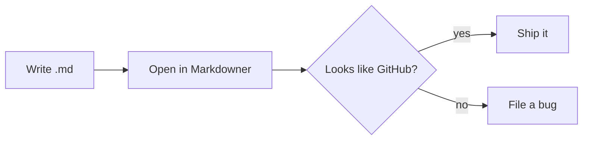

# Markdowner sample

This file exercises **GFM** features.

## Table

| Feature | Supported |
|---------|:---------:|
| Tables | yes |
| Task lists | yes |

## Tasks

- [x] Render markdown
- [ ] World domination

## Code

```js
function hello(name) {
  console.log(`Hello, ${name}!`);
}
```

> Blockquote with ~~strikethrough~~ and a [link](https://github.com).

## Diagram


